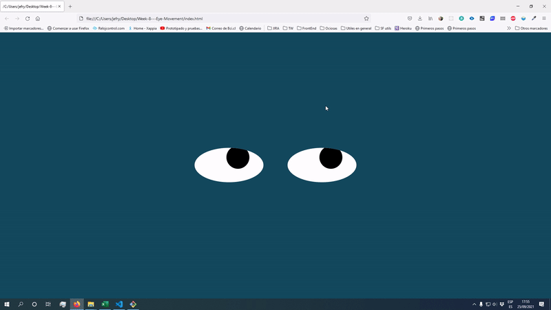

# Eyes Movement
A funny page where an eyes follow the mouse's cursor.

## Description
This is a simple page where two curious eyes just start following the cursor of your mouse when you move it along the whole page.
## How to Run
#### Download this repository.
Just clone or download this repository, and open the <code>index.html</code> file on your favorite web browser.
## Roadmap
There are some feature will be introduced in the future.
* blinking eyes!!

## License information
This code is under MIT licence, you can find the complete file [here](https://github.com/ZiurN/JefersonMITxPROEyeMovement/blob/main/LICENSE)